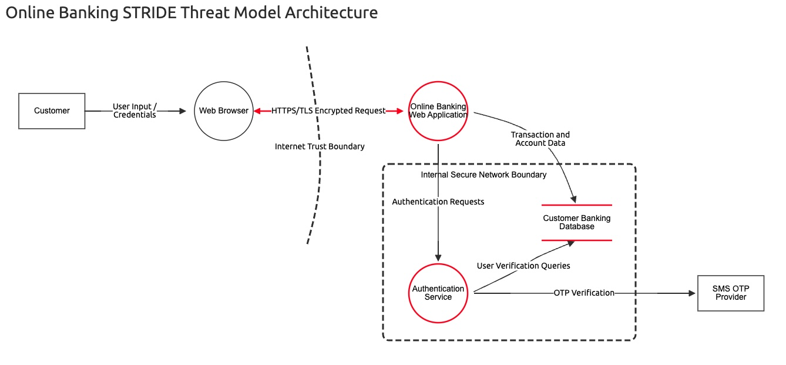
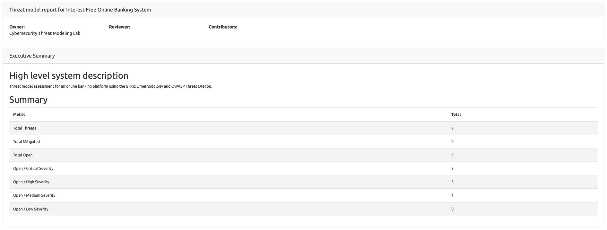
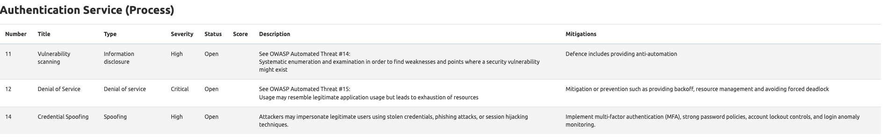
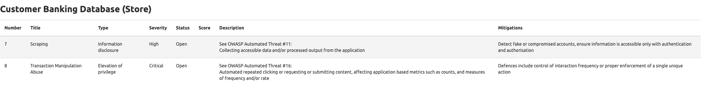
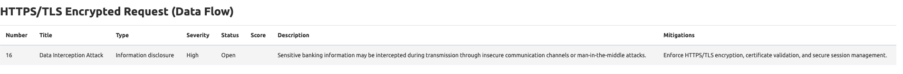
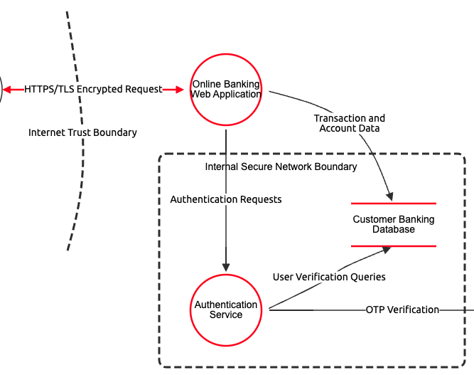

# Online Banking STRIDE Threat Modeling Lab

## Project Overview

This project demonstrates the application of the STRIDE threat modeling methodology using OWASP Threat Dragon to assess cybersecurity risks in a simulated online banking environment.

The assessment focuses on authentication security, transaction integrity, information protection, trust boundary analysis, and denial-of-service resilience within a banking architecture.

The project was developed as part of a cybersecurity threat modeling and secure systems analysis exercise using a simulated interest-free online banking platform.

---

## Objectives

The primary objectives of this project were to:

- Apply the STRIDE threat modeling framework
- Identify potential security threats across system components
- Analyse trust boundaries within the banking architecture
- Evaluate risks affecting confidentiality, integrity, availability, and accountability
- Recommend mitigation strategies aligned with cybersecurity best practices
- Demonstrate practical threat modeling using OWASP Threat Dragon

---

## Technologies and Tools Used

- OWASP Threat Dragon v2.6.2
- STRIDE Threat Modeling Methodology
- macOS Environment
- Secure Banking Architecture Concepts

---

## System Architecture Components

The online banking system model includes the following components:

### External Components

- Customer (Actor)
- Web Browser (Process)
- SMS OTP Provider (Actor)

### Internal Components

- Online Banking Web Application (Process)
- Authentication Service (Process)
- Customer Banking Database (Store)

---

## Trust Boundaries

### Internet Trust Boundary

Separates external user-controlled systems from the internal banking application environment.

### Internal Secure Network Boundary

Protects sensitive backend services including authentication systems and customer banking databases.

---

## STRIDE Threat Categories Analysed

The project evaluates threats using the STRIDE methodology:

| STRIDE Category | Description |
| --- | --- |
| Spoofing | Impersonation of users or services |
| Tampering | Unauthorized modification of data or transactions |
| Repudiation | Denial of actions without sufficient logging |
| Information Disclosure | Exposure of sensitive information |
| Denial of Service | Disruption of system availability |
| Elevation of Privilege | Unauthorized access to higher privileges |

---

## Key Security Threats Identified

### Authentication Threats

- Credential Spoofing
- Vulnerability Scanning
- Denial of Service (DoS)

### Application Threats

- Automated Transaction Abuse
- Transaction Repudiation

### Database Threats

- Scraping and Information Disclosure
- Transaction Manipulation Abuse

### Communication Threats

- Data Interception Attacks
- Potential Man-in-the-Middle Risks

---

## Security Mitigations Recommended

The project recommends several cybersecurity controls including:

- Multi-Factor Authentication (MFA)
- HTTPS/TLS Encryption
- Secure Session Management
- Role-Based Access Control (RBAC)
- Rate Limiting and Traffic Filtering
- Centralized Audit Logging
- Account Lockout Policies
- Database Encryption
- Continuous Monitoring and Alerting
- CAPTCHA and Anti-Automation Controls

---

## Repository Structure

```text
online-banking-stride-threat-model/
│
├── README.md
│
├── diagrams/
│   ├── online-banking-stride-model.jpg
│   └── online-banking-threat-model.json
│
├── reports/
│   └── online-banking-threat-model-report.pdf
│
├── screenshots/
│   ├── 01-full-stride-architecture.jpg
│   ├── 02-threat-summary-report.jpg
│   ├── 03-authentication-threats.jpg
│   ├── 04-database-threats.jpg
│   ├── 05-data-interception-threat.jpg
│   └── 06-trust-boundaries.jpg
│
└── docs/
    └── stride-analysis-summary.md
```

---

## Included Evidence

The repository contains:

- Full STRIDE architecture diagram
- Threat Dragon project JSON file
- Generated threat modeling report
- Threat screenshots and analysis evidence
- Trust boundary visualisations
- Threat mitigation recommendations

---

## Key Cybersecurity Concepts Demonstrated

- Threat Modeling
- STRIDE Methodology
- Secure Architecture Design
- Authentication Security
- Trust Boundary Analysis
- Banking System Security
- Risk Assessment
- Security Mitigation Planning
- OWASP Threat Dragon Usage
- Secure Communication Principles

---

## Screenshots

### Full STRIDE Architecture



### Threat Summary Report



### Authentication Threats



### Database Threats



### Data Interception Threat



### Trust Boundaries



---

## Disclaimer

This project was developed within a controlled educational and portfolio environment for cybersecurity learning and demonstration purposes.

The banking system represented in this repository is a simulated environment and does not contain real customer data, financial systems, or production infrastructure.
